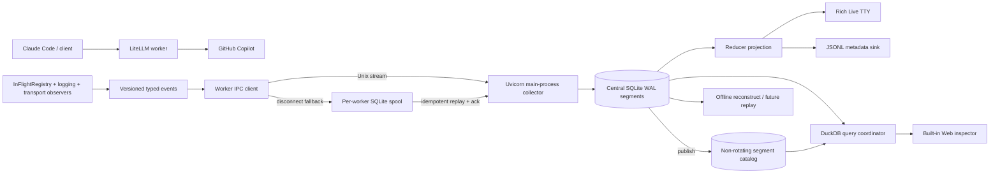

# 终端可观测、跨 worker 事件归档与请求档案设计

状态：用户决策与全部契约已冻结；三轮独立对抗性评审完成（round-1：0 blocker/4 major，round-2：0 blocker/1 major，均已闭合；round-3：0 blocker/0 major）。Phase 0 进程模型/transport primitive/DuckDB 离线门禁已完成，结论见 `exp/terminal-observability-phase0/CONCLUSION.md`；分阶段 TDD 计划已冻结，当前 `config/hookpkg/logline.py` PoC 继续在线使用，可从 Phase 1 实施

日期：2026-07-18

分支：`ghc`（私有 fork，仅 GitHub Copilot provider，本地 standalone）

关联：现有终端 PoC（`config/hookpkg/logline.py`）、请求生命周期与优雅关停 Spec（[2026-07-14-in-flight-observability-graceful-shutdown-design.md](./2026-07-14-in-flight-observability-graceful-shutdown-design.md)）、协议/工具/流保真 Spec（[2026-07-17-anthropic-protocol-tool-stream-fidelity-design.md](./2026-07-17-anthropic-protocol-tool-stream-fidelity-design.md)）

## 1. 背景

当前 hookpkg 在模型请求完成后输出一行紧凑日志，并用手写 ANSI DECSTBM 把在途请求聚合钉在 TTY 最后一行。PoC 已验证模型、请求/响应体积近似值、cache token、结束原因、工具名、thinking 载体和按模型聚合的在途 elapsed 均可从现有生命周期取得；PTY + pyte 已验证 footer 固定、并发聚合、普通日志插入、长行换行和最终清理。

PoC 证明了行为可行，但不是长期所有权模型：它只接管专用请求 logger，其他 LiteLLM/uvicorn logger 仍能直接写终端；采集、状态、格式和 ANSI 生命周期耦合在单一模块；热重载会重建 display 并丢失在途投影；非 TTY 只得到文本；多 worker 没有唯一终端 owner；当前 `↑/↓` 是语义 JSON 长度近似，不是用户选择的上游 HTTP body bytes；工具与 thinking 主要从聚合 `ModelResponse` 推断，不保证等于最终发给客户端的语义流。

本设计把 PoC 保留为过渡实现，以版本化 typed events 为稳定边界，把请求生命周期、持久档案、跨 worker 聚合、Rich TTY、非 TTY JSON、Web 检查器和后续 replay 建成同一套可恢复系统。

## 2. 设计原则与威胁模型

本 fork 是内网单机自用。优先级固定为功能、正确性、可观测性、性能、可维护性。设计不扩展企业级多租户、远程 SaaS、合规或复杂密钥治理；只保留直接影响功能正确性和本机数据完整性的边界。

业务请求不得因终端、collector、SQLite、Web 检查器或档案写入故障而失败或增加同步持久化延迟。可观测系统 fail-open；任意展示故障最终降级为 plain/JSON 输出，并显式记录降级。

## 3. 目标

1. 交互 TTY 使用 Rich Live，统一串行渲染已知 Python logger、请求完成记录和单行在途 footer，不劫持 `sys.stdout`/`sys.stderr`
2. 非 TTY 默认输出版本化 JSONL 元数据事件，systemd/journal、重定向和文件场景不产生 ANSI
3. 复用既有 `InFlightRegistry` 的请求生命周期事实，按 `surface + model + provider` 跨 worker 聚合在途请求，footer 显示每组最早请求 elapsed
4. 按 Claude Code 已有 `X-Claude-Code-Session-Id` 关联同一会话请求，在完成记录中显示确定性短 hash 与默认会话色
5. 准确采集客户端与 GitHub Copilot 上游四个 HTTP 边界的完整原始 body、headers、流式 chunk 序列和时序；TUI `↑/↓` 固定表示上游 request/response HTTP body bytes
6. 以 SQLite WAL 作为已成功提交事件的 durable source of truth；renderer 只是可重建投影，worker/collector 重启后可恢复，capture overflow/spool failure 形成显式 incomplete gap
7. 多 worker 下由 uvicorn 主进程持有唯一 collector/renderer，worker 经 Unix stream IPC 上报；collector 断连时每 worker 写独立 SQLite spool，恢复后幂等汇入
8. 提供只读 SQL 为主的本地 Web/API endpoint 和内置 Web 检查器，支持请求列表、四边界结构化 diff、raw bytes、chunk timeline 与后续受控 replay
9. 新系统先影子双写、比对真实流量，不与 PoC 同时拥有 TTY；达到验收门禁后一次切换 renderer

## 4. 非目标与延后项

- 不在本轮构建 Textual 全屏 TUI；shell scrollback 与普通代理终端体验保持一等公民
- 不通过 IP、User-Agent、连接或消息历史推断 session；缺显式 session 时诚实显示无 session
- 不把 terminal archive 替代 `LiteLLM_SpendLogs`；两者服务不同的生命周期与原始边界
- 不承诺 collector 跨主机聚合
- 不让 renderer 根据 stale 自行编造业务成功/失败终态
- `/home/xp/src/zip-transcripts` 归档集成仅留 TODO。本轮只封存 immutable SQLite segments、创建新 active DB、保留旧 segment 并在总量达到阈值时告警；不自动迁移或删除
- 网络 replay 分阶段实施：先完成离线重建与 chunk 时序复现，再增加显式受控网络 replay

## 5. 与既有在途/关停设计的所有权边界

既有 in-flight/graceful-shutdown Spec 的 `InFlightRegistry`、transport/accounting lease、stage、terminal reason 和 shutdown drain 是请求生命周期唯一真相源。本设计不得在 hookpkg 或 collector 中建立第二套会影响业务生命周期的登记表。

本设计新增的 event adapter 订阅 registry mutation，把 `registered/updated/deregistered/shutdown_dropped` 映射成版本化事件；collector reducer 从 durable journal 重建跨 worker UI state。renderer 发现 event gap、deadline 超期或缺终态时只标记 anomaly/stale，不回写或替代 registry 结果。

在既有 registry 尚未落地的过渡阶段，可用 CustomLogger pre-call/success/failure 和 streaming hook 产生 shadow events，但这些事件只用于字段形态 PoC，不成为最终生命周期契约。切换新 renderer 的 gate 包含迁移到 registry 事实源。

## 6. 架构总览



### 6.1 采集器

采集器只把已有事实转换成 immutable events，不格式化终端文本。来源包括：

- `InFlightRegistry` 生命周期与 stage
- 已知 Python `LogRecord`
- proxy HTTP 入站/出站 observer
- provider-gated shared httpx upstream observer
- 最终 Anthropic 客户端语义流 observer（工具与 thinking）
- retry/attempt 路由事件
- renderer/IPC/spool 自身 anomaly

### 6.2 Collector 与 reducer

uvicorn 主进程必须是唯一 collector、central SQLite writer 和交互 stdout owner。worker 不直接画 TUI。该进程模型尚属最大技术未知，实施前必须用真实 uvicorn direct/workers/restart/SIGTERM PoC 证明主进程可在 worker spawn 前创建并在 shutdown 后最后关闭 collector；若 uvicorn 主进程无法稳定承载，则回到专用 collector 子进程 ADR 修订，不允许 worker leader election 或多个 Live 竞争 stdout。

Phase 0 实测已证明 direct、`Multiprocess(workers=2)` 和 `ChangeReload` 三拓扑均可由 parent 唯一持有 collector，含 worker crash replacement、reload replacement 与 SIGTERM lifespan shutdown。direct 模式有一条强制启动契约：runner 必须在 `server.run()` 外层先持有 SIGTERM handler；uvicorn graceful shutdown 恢复旧 handler 并 re-raise 后，外层 handler接住信号，`server.run()` 才能返回到 collector `finally`。若旧 handler 是 OS 默认，进程会在 collector cleanup 前以 SIGTERM 终止。

collector 先持久化事件，再把 committed event 交 projection reducer。Projection reducer 仅由 collector 线程串行执行，不需要跨线程共享可变请求状态；它与既有 `InFlightRegistry` 内部的 atomic reducer 是两个不同组件。Rich renderer、JSONL sink 和 Web 查询都消费 durable state/投影，不直接依赖 worker 内存。

## 7. 事件协议

### 7.1 Envelope

所有 IPC、spool、central journal 和 JSONL 元数据事件使用版本化 envelope：

- `schema_version`
- `event_id`
- `event_type`
- `worker_instance_id`
- `worker_sequence`
- `request_id?`
- `session_hash?`
- `occurred_at_utc`
- `monotonic_offset_ns?`
- `severity?`
- `payload`
- `blob_digests`

未知字段必须保留；同一 major schema 内只允许向前兼容增字段。破坏性语义变化提高 schema major 并提供 segment migration/read compatibility。事件身份 `(worker_instance_id, worker_sequence)` 全局幂等；collector 另分配单调 `commit_sequence` 作为跨 worker 展示顺序。

### 7.2 事件类型

至少包含：

- `request.accepted`
- `request.routed`
- `upstream.started`
- `upstream.first_byte`
- `downstream.first_byte`
- `request.streaming`
- `request.retrying`
- `request.completed`
- `request.failed`
- `request.cancelled`
- `request.timed_out`
- `request.shutdown_dropped`
- `request.stale_detected`
- `http.body_started/body_chunk/body_completed/body_incomplete`
- `log.record`
- `renderer.failed/recovered/degraded`
- `ipc.disconnected/reconnected`
- `spool.replayed`
- `segment.rotated/archive_pending`

Projection reducer 对 request terminal event 做穷举匹配；terminal 后再到达非重复 lifecycle event 记 anomaly，不静默改写终态。Registry terminal reason 与事件/marker 的穷举映射固定为：`completed → request.completed → [ OK ]`、`failed → request.failed → [FAIL]`、`cancelled → request.cancelled → [CANC]`、`timed_out → request.timed_out → [TIME]`、`shutdown_dropped → request.shutdown_dropped → [CANC] reason=shutdown_dropped`。既有 in-flight Spec 的 registry terminal reason 已包含 `timed_out`，两端必须保持一致；`shutdown_dropped` 保持独立原因，不伪装成用户主动取消。

## 8. IPC、spool 与持久化

### 8.1 IPC

worker 与主进程 collector 使用 Unix stream socket；生命周期、日志和 spool-range 通知采用长度前缀 JSON（`orjson`），不使用 pickle。连接握手交换 schema version、worker instance ID 和 collector committed sequence。worker instance ID 在每次 worker boot 时生成 UUIDv4，并写入该 worker spool 元数据；PID 不作为唯一身份且 UUID 不复用。worker 只 enqueue，不等待 terminal renderer；IPC 发送失败立即进入本地 spool，不阻塞模型请求。

大 body/chunk bytes 不内嵌为 base64 JSON，也不直接写 Unix socket。捕获线程把 chunk 交给有界的本地异步 writer；writer 以批次先提交到该 worker SQLite spool 的内容池与 manifest，随后 IPC 只发送 `(worker_instance_id, committed_sequence_start, committed_sequence_end)` range 通知。collector 从同机 spool 以只读事务拉取已提交 rows/blobs，写入 central segment 后返回 durable ack。

“业务请求不被可观测系统阻塞”优先于“档案在任意过载下完整”，两者不伪装成可同时无条件满足：writer 队列满或 spool 不可写时，capture producer 不做同步 SQLite 写、不等待队列，立即原样转发业务 bytes，并通过预留的轻量 anomaly 通道提交 `capture_overflow`；对应 body 标记 `incomplete:overflow`。若 anomaly 通道也不可用，worker 在内存保留一个按 request 合并的 overflow bit，下一次成功提交时补写。硬崩溃前尚未进入 writer/spool 的最后短批次允许丢失，恢复后标记 `incomplete:crash_tail`。生命周期小事件可以直接走 IPC，但在断连或未获 ack 时也进入 worker spool；极端 spool 故障时同样 fail-open 并明确降低 durability，不能继续宣称该请求档案闭合。

### 8.2 Worker spool

每个 worker 使用独立 SQLite WAL，避免多 writer 争用同一 DB。worker sequence 单调且 worker instance ID 不复用。collector 恢复后按 event identity 幂等导入，返回 durable ack；worker 只在 ack 后删除/compact 已确认事件。collector crash、worker restart、重复 replay 和 ack 丢失都不得生成重复逻辑事件。worker 死亡后主进程仍可从其 spool 导入已提交内容；spool 只有在全部 range 获 durable ack 且 owner worker 已退出后才可回收。

完整 chunk/body 异步批量持久化，优先不影响模型流；正常结束与优雅关停必须 flush。硬崩溃允许丢失最后未提交短批次，但对应 body/event 必须标记 `incomplete`，不得伪装成完整档案。

### 8.3 Central SQLite

central SQLite WAL segments 是**已成功提交事件**的 source of truth；capture overflow/spool 故障明确形成 incomplete gap，不把未提交事实伪装成 durable。内存投影有界，可随时从 committed events 重建。每个 request 在 `request.accepted` commit 时绑定唯一 owner segment；该 request 的后续 events、manifests 和 content-pool blobs 均写入同一 segment。内容池以 segment 为作用域并自包含，不跨 segment 引用。

active segment 达到 2 天或 1GiB任一阈值时停止接收新 request，进入 draining；立即创建/fsync 新 active DB 接收后续 request。draining segment 允许暂时超过阈值，直到其 owner requests 全部 terminal、异步 chunk batch 已 flush、manifest/blob 引用闭合后才 checkpoint、seal 并原子发布 immutable segment。长请求可让旧 segment 长时间处于 draining，但不能把一个 request 拆到两个 segments。

collector/recovery 在 seal 前验证每个 manifest 引用的 blob 都存在且 digest 匹配；引用缺失则 request/body 标 `incomplete` 并禁止把 segment声明为全闭合。已写 blob 但没有任何 committed manifest/event 引用的 orphan 在 startup recovery 或 seal 时 GC。进程崩溃后仍有 owner request 的 segment恢复为 draining；确认 owner worker 已死亡且无可导入 spool 时，为这些 request写恢复型 `request.shutdown_dropped` + incomplete event 后再闭合。registry 已随 worker 死亡而不存在时，collector recovery 是唯一允许生成该恢复终态的组件；它只能生成 `shutdown_dropped/incomplete`，不能推断 `completed/failed/timed_out`。

活跃 worker 的 request 即使超过 deadline/stale 也不由 collector强制终止或 seal；draining segment 持续告警并等待 registry/shutdown 的真实终态。永久长请求可能让 segment 长期 draining，这是保持 request 不跨 segment和不编造终态的有意取舍。旧 immutable segment 不删除；归档器 TODO 完成前只做总量告警。

collector 另维护一个非轮转 `catalog.sqlite`，只保存 segment manifest、路径、schema version、commit/time/worker 范围、闭合状态、公开表统计和 session aliases，不保存 request body。segment publish 与 catalog 登记采用可恢复的两阶段状态（`publishing → published`）；startup 对目录与 catalog reconciliation，避免已发布 segment 不可发现或 catalog 指向半成品。

未来 zip-transcripts 交接需另写说明书，定义 immutable segment manifest、checksum、archive receipt 和恢复；本阶段不修改 `/home/xp/src/zip-transcripts`。

## 9. 四边界原始档案

### 9.1 边界

每个模型请求保存：

1. 客户端进入代理的 request body
2. 代理发给 GitHub Copilot 的 upstream request body
3. GitHub Copilot 返回的 upstream response body/chunks
4. 代理最终发给客户端的 response body/chunks

body 不设尺寸上限或主动截断。原始 bytes 单独进入 zstd 压缩、BLAKE3 digest 去重的内容池，event/manifest 只引用 blob。拼接 body 是 chunk manifest 的派生视图，不复制保存第二份完整 body。writer overflow、spool failure或硬崩溃尾批次按 §8 标记 incomplete，是可观测故障而非静默截断。

### 9.2 Chunk fidelity

流式边界保存每个原始 chunk 的 bytes digest、sequence、UTC wall time 和相对 request monotonic offset；保留网络 chunk 边界，不只保存解析后的 SSE frame。由此可离线重建完整 body、复现 split-frame、计算准确 body bytes，并和语义 frame 视图比较。

### 9.3 上游 observer seam

在共享 `custom_httpx` transport 增加 observer seam，但仅当 `custom_llm_provider=github_copilot` 且 archive capture 开启时安装。请求在最终 `httpx.Request` 构造后捕获序列化 body；streaming request/response 包裹原始 ByteStream/AsyncByteStream，逐块 observe 后原样 yield。observer 任意错误必须旁路原始流，不改变 chunk 边界、异常、关闭传播、backpressure 或 provider 行为。

provider transformation 只提供语义元数据，不承担准确上游 body bytes；全 provider transport capture 不在本轮范围。

Phase 0 transport-contract PoC 已覆盖逐字节切点、上游异常、observer 自身异常 fail-open、消费者提前关闭、chunked request、最终 JSON UTF-8 bytes 和真实 `AsyncBaseTransport` wrapper。observer transport 创建的 request wrapper 必须在 inner `handle_async_request()` 返回或抛错后由 observer `finally` 关闭；response wrapper 由 `httpx.Response.aclose()` 关闭并级联 inner。生产实现仍须分别接入并验证 `LiteLLMAiohttpTransport`、`AsyncHTTPTransport`、retry-created clients 与同步 handler。

### 9.4 Headers 与 secrets

保存四边界 headers。固定 secret header 集合只覆盖明确凭据字段（例如 `authorization`、`x-api-key`、proxy key/cookie 等）；其值在采集入口替换为掩码前后缀，完整 secret/key 不进入事件队列、SQLite、TUI、JSONL、Web/API、导出或 replay。普通 header 原值保存。网络 replay 使用当前 GitHub Copilot authenticator，不从档案恢复旧凭据。

SQLite 目录权限 `0700`、文件 `0600`，不做应用层或整库加密。

## 10. Session 关联

Claude Code 2.1.211 二进制包含 `X-Claude-Code-Session-Id`；LiteLLM 通用 header 提取器接受 `x-*-session-id` 并写入 `litellm_session_id`/SpendLogs `session_id`。实测最近 24 小时样本 237/237 条 Claude 请求带 session ID，共 5 个 session，单 session 最多 175 请求。因此不需要 launcher、IP/User-Agent 或消息历史推断。

TUI 不显示原始 session ID，而显示确定性 4 位 Crockford Base32 短 hash，例如 `■ 7K3M`。使用本机持久 salt 的 keyed BLAKE2s；发现碰撞时扩展冲突项到 5–6 位。非轮转 catalog 的公开 `session_aliases` 表是 alias 持久化 home，保存 full digest、display prefix length 与首次/最近出现时间；collector 内存 projection 保存运行时全量 alias map，rotation 不重置它，startup 从 catalog 一次性恢复，故不会出现新 segment 切换或重启后的短暂碰撞窗口。会话色默认开启，只作用于 `■` 和短 hash；核心语义不只依赖颜色。无 session 显示中性空心 `□ ----`。

颜色支持 `auto|truecolor|256|16|none`，尊重 `NO_COLOR`，并有固定主题降级。

## 11. TTY 与非 TTY renderer

### 11.1 Logger 所有权

worker 进程把 root、LiteLLM 三个专用 logger 和 hookpkg logger 的已知 handler 接到 typed event adapter，经 IPC/spool 上报，不直接拥有 Rich。uvicorn 主进程把自己的 root、uvicorn/uvicorn.error/uvicorn.access handler 接到 collector 本地 adapter。collector 是唯一 Rich stdout owner；不得 monkey-patch stdout/stderr。安装时保存各进程原 handler，降级/关闭时恢复。

默认显示规则可配置，profile 为 INFO+；遵循 logger 自身 level，未启用 DEBUG 不采集。模型 endpoint 的 uvicorn access 被富请求完成记录替代；其他 HTTP endpoint 保留统一 typed access 记录。

### 11.2 Rich Live

Rich 13.9 已是项目依赖。交互 renderer 使用一个 `Console` 和一个单行 `Live` footer；普通日志、traceback 和完成记录必须通过同一 Console 输出，Rich 负责 Unicode 宽度、resize、自然换行与 footer 重绘。ERROR 展开完整 traceback。

renderer 异常最多原地重建一次；再次失败停止 Live、恢复原 handler并永久降级 plain，直到进程重启。renderer 故障不得影响模型请求。

多 worker 若主进程 collector PoC 未通过，不允许多个 worker 分别画 Live；必须自动降级 JSON/plain。

### 11.3 完成记录契约

字段采用会话优先顺序：

```text
[ OK ] 17:18:53 ■ 7K3M anthropic/claude-opus-4.8@ghc 200 27.30s ttft:1.24s ↑1.5MB ↓17.6KB ↑2+567.3k+4.7k ↻0%+99%+1% ↓1.8k tool_use(Bash,Bash,Read) think:enc(1)
```

- marker：`[ OK ]`、`[FAIL]`、`[CANC]`、`[TIME]`；`shutdown_dropped` 使用 `[CANC]` 并附 reason
- 时间：本地完成时间 `HH:mm:ss`；JSON/SQLite 保存 UTC ISO 与 monotonic timing
- session：`■ short-hash`；无 session 为 `□ ----`
- identity：逻辑 API surface/model + provider badge，例如 `anthropic/claude-opus-4.8@ghc`
- HTTP：客户端最终状态；有上游重试才附 `retry(429×2,timeout×1)`，按发生顺序保留不同原因并折叠相邻同类
- duration：固定两位小数；流式请求在 downstream 首次真实 yield 时自行计时并显示可靠 TTFT；generation timing 进入 archive/JSON，不默认占行
- session badge 后各字段使用稳定语义 style；慢请求固定阈值默认 ≥10s 黄、≥30s 红，可配置
- `↑/↓`：GitHub Copilot upstream request/response HTTP body bytes，不含 headers、HTTP framing、压缩/TLS overhead
- input token：固定 `cache_write + cache_read + uncached_input`；缺值显示 `?`，不把未知伪装成 0
- percentage：同顺序三段 `write% + read% + uncached%`，与 token 三段颜色一一对应；任一 token 段未知时整段百分比省略（分母不闭合），总量为 0 时也省略
- output token：`↓N`
- tools：基于最终发给客户端的语义块，按真实顺序完整显示且保留重复项，例如 `tool_use(Bash,Bash,Read)`；允许完成记录自然换行，不截断或折叠
- thinking：基于最终客户端语义块，按首次出现顺序显示规范化载体类别与数量，例如 `think:enc(1) redacted(1)`；不显示请求配置 `(thinking:adaptive)`
- stream 是常态，不加符号；非流式只在尾部加 `(non-stream)`
- session 方块不是 stream marker
- streaming 已向客户端 commit HTTP 200 后若中途失败，marker 显示 `[FAIL]`，HTTP 字段仍忠实显示 `200`；业务终态与已提交协议状态不互相改写

### 11.4 在途 footer 契约

```text
[ .. ] 3 in-flight  anthropic/claude-opus-4.8@ghc ×2 12.40s  responses/gpt-5.6-sol@ghc 2.10s
```

按 `surface + model + provider` 聚合，不按 session 拆组，也不在 footer 显示 session。每组只显示最早请求 elapsed；最久组优先。4Hz 刷新，elapsed 固定两位小数。宽度不足时保留最久的若干完整组，尾部显示 `+N groups`；不得硬截断半个字段或轮播。阶段详情只进 archive/JSON，不在 footer 展示。

超过由业务 request timeout/retry budget/grace 推导的 deadline 时标记 stale 并告警，但继续显示，直到 registry 提供真实 terminal/cancel/shutdown 事件；renderer 不自行删除或转 failed。

### 11.5 非 TTY JSONL

非 TTY 默认输出所有元数据事件：请求 lifecycle、attempt、普通 logger、renderer/IPC/spool anomaly、segment rotation。JSONL 不包含完整 body，只包含 blob digest、bytes、完整性状态和关联 ID；完整内容从 SQLite 查询。支持 `mode=auto|interactive|plain|json|off` 显式覆盖。

## 12. Web/API 与查询契约

提供本地 Web/API endpoint 和内置 Web 检查器。主查询接口为只读 SQL endpoint；底层 SQLite 表是公开契约，必须版本化、文档化并提供 migration compatibility，不能把任意表改动视为内部实现细节。每个 immutable segment 固定自己的 `schema_version`，发布后不原地 migration；同一 table major 内不删除/重命名列、不改变列语义或类型，只允许新增 nullable/defaulted 列。破坏性变化创建新版本表并保留旧表读取器；deprecated 表/列至少跨一个 schema major 可读，移除读取支持需另发 migration 工具与 ADR。

SQL endpoint 的逻辑公开表跨全部选中 segments，segment 边界对用户透明。Query coordinator 在请求开始时冻结 catalog snapshot，按用户 SQL 中可安全提取的时间/segment predicate 做 pruning；无法证明可裁剪时选择全部 segments。执行层采用 in-process DuckDB，把每个 SQLite segment 的版本化公开表经 schema adapter 注册为 relations，并生成 `UNION ALL BY NAME` 逻辑 views；用户 SQL 只对这些逻辑表执行，不能自行 `ATTACH`、加载 extension 或写入 segment。active/draining segment 通过 SQLite read transaction 取得一致读取，immutable segment 只读打开。查询结果流式返回并支持取消/资源上限。

Phase 0 使用 DuckDB Python 1.5.4 验证：wheel 不内置 `sqlite_scanner`，关闭 autoinstall/autoload 时纯 wheel attach 必然失败；构建期把官方 sqlite extension 准备到隔离目录后，新连接可在 autoinstall/autoload 均关闭时显式 `LOAD sqlite`，并对两个异构 SQLite schema 完成 `UNION ALL BY NAME`。因此运行时不得下载 extension；打包必须把与 DuckDB 版本/平台/架构匹配的官方 extension 作为同一 artifact，启动显式校验/加载。依赖升级必须连同 extension artifact 一起更新并测试。Phase 5 仍需验证 active WAL snapshot、多 segment 性能、取消/资源上限和完整公开类型 adapter；若 vendored extension 在目标打包环境不能稳定加载，必须回 ADR 选择另一 query engine，不能降级成逐 segment 执行后在 Python 中拼任意 SQL 结果。

Web 检查器至少提供：

- 请求列表与按时间/session hash/model/surface/provider/status/tool/attempt 过滤
- 请求 lifecycle 与 chunk timeline
- client request/upstream request/upstream response/client response 四边界并排结构化 diff
- JSON/SSE 解析视图与 raw bytes 切换
- 完整 headers（secret 集合字段仅有掩码值）
- 原始 usage 与规范化 usage
- 工具顺序、thinking 载体、retry 序列与 anomaly
- segment/schema version 与 body completeness

Web/API 的读取不应阻塞 collector writer；用只读 connection/snapshot。SQL endpoint 只允许一条只读 statement，拒绝 attach、pragma mutation、extension load 和写事务。这里是正确性/数据完整性边界，不扩展远程多租户设计。

## 13. Replay

第一阶段只提供离线重建：按原 chunk 顺序和 monotonic 间隔重放到本地 consumer、重建四边界 body、运行 transformation diff/oracle，不发外部网络。

后续增加受控网络 replay：明确目标 endpoint、默认 dry-run、使用当前 provider authenticator，不从 archive 恢复旧 secret。重放事件必须关联 source request/segment 并写回 archive，避免无法追踪副作用。

## 14. 配置

长期配置进入 `config.yaml` 的 `terminal_logging`，不继续扩展 `hooks.config.json`。主进程启动前必须读取静态项：mode、collector/IPC、central/spool paths、segment rotation、多 worker policy。动态项：logger rules、theme、颜色模式、慢请求阈值、footer refresh、展示字段；收到 SIGHUP 后重读 config 并发送 `reconfigure` event，静态项变化明确提示需重启。

默认关键值：

- `mode: auto`
- `json_when_not_tty: true`
- `refresh_hz: 4`
- `slow_yellow_seconds: 10`
- `slow_red_seconds: 30`
- `segment_max_age: 2d`
- `segment_max_bytes: 1GiB`
- `archive_capture: true`
- `capture_provider: github_copilot`
- `capture_bodies: all_four_boundaries`
- `capture_chunks: true`

当前 PoC 的 `request_log` 配置保留到切换完成；新 renderer 切换后迁移并删除重叠所有权，不能留下双 footer/双完成记录。

## 15. 故障与关停

- collector/renderer/SQLite/IPC 故障 fail-open，不阻塞请求
- renderer 重建一次后仍失败则永久降级 plain
- collector 不可达时 worker 写独立 SQLite spool；collector 恢复后幂等 replay + ack
- central SQLite 写失败时停止宣称 durable，降级 plain/JSON 并持续单行告警；不丢失告警事实
- graceful shutdown 与既有 in-flight Spec 共用一个绝对 deadline和一条序列：uvicorn 停接入后，terminal archive 只停止新 root request admission，已登记 request、logging/accounting child 与 terminal/shutdown 事件仍可提交；既有 LoggingWorker quiesce、managed child drain、`shutdown_dropped` settle 和 logging worker stop 完成后，worker flush IPC/spool，collector commit/ack pending ranges并标记未闭合 body incomplete；随后 checkpoint active/draining WAL、停 Web readers、停 Live/恢复 handler与光标、关闭 collector；最后才断 aiohttp/prisma/redis。collector admission 不得在 `shutdown_dropped` durable commit 前关闭
- collector cleanup 是同一 deadline 到期后的本地 best-effort cleanup，不预留或开启第二个 cleanup 窗口；deadline 已到仍执行非阻塞 close/restore/checkpoint 尝试，失败即记录 incomplete/degraded并继续最终 teardown，不无限等待 WAL checkpoint、Web reader 或 ack
- 强制退出允许最后异步 chunk batch 未提交，但下次恢复必须能识别 incomplete，不得将其算入完整 body oracle
- SIGHUP reconfigure 不销毁 reducer state或在途 footer

## 16. 验收门禁

### 16.1 单元/property tests

- envelope/schema compatibility、未知字段保留、migration
- `(worker_instance_id, sequence)` 幂等导入、ack 丢失、重复 replay
- reducer 生命周期穷举、terminal 后事件、stale/anomaly、commit sequence
- session hash 稳定、碰撞扩展、无 session fallback
- 完成行字段语义、三段 token/比例未知值、工具顺序重复、thinking 分类、non-stream、retry、四态 marker
- footer 聚合、最早 elapsed、排序、`+N groups` 响应布局
- secret 固定集合掩码边界，断言原值不出现在任一 event/DB/JSON/TUI/export
- segment 2d/1GiB rotation、crash point、WAL checkpoint、immutable publish
- content pool digest 去重、chunk manifest/body 重建、`incomplete:overflow|crash_tail|spool_failure`

### 16.2 PTY + pyte

- Rich Live footer 始终位于最后一行；普通 INFO、完整 traceback、多行完成记录不覆盖 footer
- resize、80/120/宽屏、Unicode、truecolor/256/16/NO_COLOR
- 多模型组溢出只出现完整组 + `+N groups`
- session badge 同 hash同色，无 session 空心；复制为无色文本仍可解码
- renderer 故障重建一次，再失败 plain；退出恢复光标与终端
- 正样本对照：注入已知坏 renderer，PTY 必须检出 footer 覆盖/吞行，修复后连续多次稳定通过

### 16.3 多进程故障注入

- uvicorn direct、workers=2、worker restart、collector restart、主进程 SIGTERM/第二次信号
- worker IPC 断连写 spool、collector 恢复 replay、ack 丢失/重复导入
- 两 worker 同 request/session 的全局 commit 顺序和幂等
- 主进程 stdout 单 owner；检测到 unsupported process topology 时自动 JSON/plain，无双 Live
- SQLite busy/full/I/O error、writer queue overflow、renderer exception、Web 长查询，均不影响模型响应；overflow 必须产生 incomplete/anomaly，不允许同步写盘回压业务流

### 16.4 Transport fidelity

- shared httpx observer 关闭时字节/异常/chunk 边界完全等价
- 开启时每字节切点、SSE 多帧/半帧、UTF-8 边界、自然 EOF、上游异常、客户端取消
- observed chunks 拼接等于真实 upstream body oracle；`↑/↓` 等于实际序列化/读取 body bytes
- observer failure 注入后原始流继续，archive 标记 capture failure
- 四边界 diff 能复现已知 Anthropic↔OpenAI transform 与 split-frame 案例

### 16.5 真流量影子门禁

PoC 继续拥有 TTY；新系统影子采集至少覆盖：

- Claude Messages stream/non-stream
- GPT Responses stream/tool/reasoning
- 同 session 并发与至少两个 session
- cache write/read/uncached
- tool 顺序重复、thinking enc/redacted
- upstream retry、429/timeout、客户端取消
- graceful shutdown 中在途请求

逐请求比较 shadow completion 与现有日志/SpendLogs/真实 wire：model、surface、provider、status、duration、TTFT、upstream bytes、tokens、tools、thinking、session、terminal reason。任何 lifecycle gap、body digest 不闭合、双记录或遗漏都阻塞 renderer 切换。

## 17. 实施阶段

1. **Phase 0 — Spec 后 PoC 门禁（已完成）**：uvicorn 主进程 collector 三拓扑、shared httpx transport observer contract、DuckDB vendored sqlite extension/跨 segment relations 均已验证；资产与红/绿结论见 `exp/terminal-observability-phase0/`
2. **Phase 1 — Shadow event archive**：versioned schema、worker adapter、single-worker collector prototype、central SQLite/content pool/chunk manifest/rotation、JSONL；不拥有 TTY
3. **Phase 2 — Rich TUI**：typed logger adapters、Rich Live、完成行/footer、session hash、fault fallback；仍只在测试/显式开关下，PoC 默认 owner
4. **Phase 3 — 四边界 transport capture**：client middleware、GitHub Copilot httpx observer、final downstream observer、完整 diff/fidelity tests
5. **Phase 4 — 多 worker IPC**：uvicorn 主进程 collector、Unix stream、per-worker spool、replay/ack、process fault tests
6. **Phase 5 — Web/API 与离线 replay**：DuckDB 跨 segment query coordinator、只读 SQL endpoint、内置 inspector、四边界 diff/raw/chunk timeline、offline reconstruct
7. **Phase 6 — 真流量 shadow + 切换**：字段/生命周期/字节闭合验收；一次切换 TTY owner，移除重叠 PoC ownership，保留 plain fallback
8. **Phase 7 — 受控网络 replay**：当前 authenticator、dry-run、目标确认、source linkage
9. **TODO — zip-transcripts 归档交接**：另写 immutable segment 说明书与 archive receipt；当前不实施

每个 Phase 都是完整可验证交付，不因阶段划分删除最终目标。Phase 0 未证明主进程 collector 时必须回到 ADR 讨论 collector 子进程，不得带着未证假设进入 Phase 4。

跨 Spec 依赖：Phase 1 shadow archive 可临时消费 CustomLogger/transport facts；Phase 6 renderer 切换前必须先完成 [in-flight/graceful-shutdown Spec](./2026-07-14-in-flight-observability-graceful-shutdown-design.md) 的 `InFlightRegistry`、terminal reason（含 `timed_out`）和 shutdown quiesce 接线。没有 registry 唯一事实源时不得宣布长期 renderer 完成。

## 18. 未采纳方案与原因

- **继续把手写 DECSTBM 当长期 renderer**：PoC 可用，但终端宽度、resize、logger 竞争和生命周期维护长期由本项目承担；选 Rich Live
- **Textual/full-screen**：改变 shell scrollback和代理运行方式；本需求是增强日志，不是全屏运维应用
- **只接管请求 logger**：异常期其他 logger 会打断 footer；选统一已知 logger
- **劫持 stdout/stderr**：对子进程、traceback、调试器和第三方库影响过大；只替换已知 handlers
- **asyncio actor renderer**：logging 可来自任意线程且终端 IO 同步；选 collector 单线程 reducer
- **共享锁状态作为长期事件模型**：采集/状态/渲染耦合，无法可靠恢复或多 worker 聚合
- **无界内存队列**：collector/终端卡住可拖垮代理；改用 SQLite durable journal + worker spool
- **分级丢事件队列**：用户选择完整历史；只允许异步批次硬崩溃尾部缺失并显式 incomplete
- **专用 collector 子进程**：当前用户选择 uvicorn 主进程；保留为 Phase 0 PoC 失败时的回退 ADR，不静默切换
- **worker leader election**：split-brain、failover和终端 ownership 复杂
- **按 session 拆 footer 模型组**：用户选择按 surface/model/provider 聚合；session 只在完成记录
- **footer 展示阶段/耗时范围/轮播**：用户选择只显示最早 elapsed、最久组优先、`+N groups`
- **工具去重/计数折叠**：用户要求最终客户端顺序完整且保留重复项
- **显示 `(thinking:adaptive)`**：请求配置不是响应事实；只显示最终 thinking 载体类别/数量
- **把 `■` 当 stream marker**：方块是 session 标识；stream 默认无标记，non-stream 才标注
- **IP/User-Agent/history session 推断或 launcher 注入**：真实 Claude Code header 已由代理完整接收，不需要推断或客户端包装
- **只保存拼接 body/SSE frame**：会丢真实 HTTP chunk 边界和时序；选完整 chunk manifest
- **在 transformation 层统计上游 bytes**：拿到的是语义对象，不是最终序列化 body；选 provider-gated shared httpx observer
- **保存完整 secrets/keys**：最终决定只保留固定集合字段的掩码前后缀，replay 使用当前 authenticator
- **自动删除旧 segments**：归档 TODO 完成前不删除，只告警
- **立即替换 PoC**：选影子双写与独立验收后一次切换

## 19. 开放技术验证项（非产品决策）

1. uvicorn 主进程在 direct/multiprocess/reload 拓扑中的 collector 创建、socket 继承与 shutdown seam
2. shared httpx sync/async/aiohttp transport 的统一 observer protocol 与关闭传播
3. client ingress/final downstream bytes 捕获如何与 FastAPI/StreamingResponse 保持零语义变化
4. SQLite content pool 对大 SSE chunk 流的批量、压缩和写放大基线
5. Rich Live 替换/恢复 LiteLLM 与 uvicorn handlers 的准确集合与 reload 行为
6. 公开底层 SQL schema 的 versioning/migration 流程、DuckDB 离线 SQLite scanner 能力与跨 segment `UNION ALL BY NAME` 查询机制

这些项由 Phase 0/对应阶段 PoC 回答；结果只能调整实现路径，不能静默削减已冻结功能。若结果要求改变本 ADR 的核心 ownership 或 durability 决策，必须回到用户重新裁决并追加 ADR。
